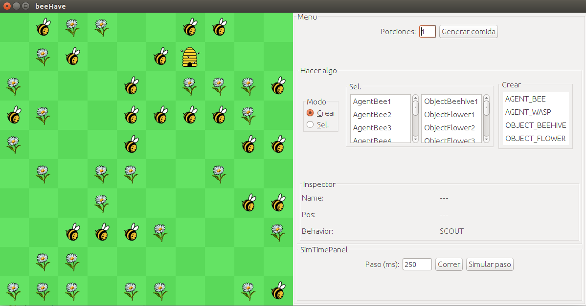

## beeHave
### Multi agent system simulator

#### Installation
1. Download the source code ("`Download ZIP`" in upper part of the page).
Make sure you're on the `master` branch.

2. Extract .zip.
3. Execute .jar.
  * _If images don't show up, run from terminal (Linux) and make sure the .jar is in the project's root folder, as it is by default._

#### Usage instructions

* Food generation panel
 * Randomly place N flowers in the environment.
* Click effect panel
  * Switch between `Create` and `Select` modes.
  * Create Mode:
    * Select entity type to create on the list.
    * Click on a tile in the environment to create an entity there.
  * Select Mode:
    * Select entities from the lists or environment.
    * Drag and drop entities in the environment.
* Inspector panel
  * Inspect the attributes of the currently selected entity.
* Time control panel
  * Play/stop the simulation.
  * Change the step time of the simulation.
  * Simulate a single step.

### Español

#### Instalación
1. Descargar el código fuente ("`Download ZIP`" en la esquina superior derecha) estando en la rama `master`.

2. Extraer .zip.
3. Ejecutar .jar.
  * _Si no se muestran las imágenes, correr desde terminal (Linux) asegurándose de que el .jar está en la carpeta raíz del proyecto, como lo está por defecto._

#### Instrucciones de uso

* Panel de generación de comida
 * Colocar aleatoriamente N flores en el entorno.
* Panel de efecto de click.
  * Cambiar entre los modos 'Crear' y 'Seleccionar'.
  * Modo Crear:
    * Elegir en la lista el tipo de entidades a crear.
    * Hacer click en el entorno para crear una entidad.
  * Modo Seleccionar:
    * Seleccionar una entidad del entorno o las listas.
    * Arrastrar y recolocar una entidad del entorno.
* Panel de inspección
  * Inspeccionar los atributos de la entidad seleccionada.
* Panel de control de tiempo
  * Correr/parar la simulación.
  * Cambiar la duración de paso de la simulación.
  * Simular un único paso.
